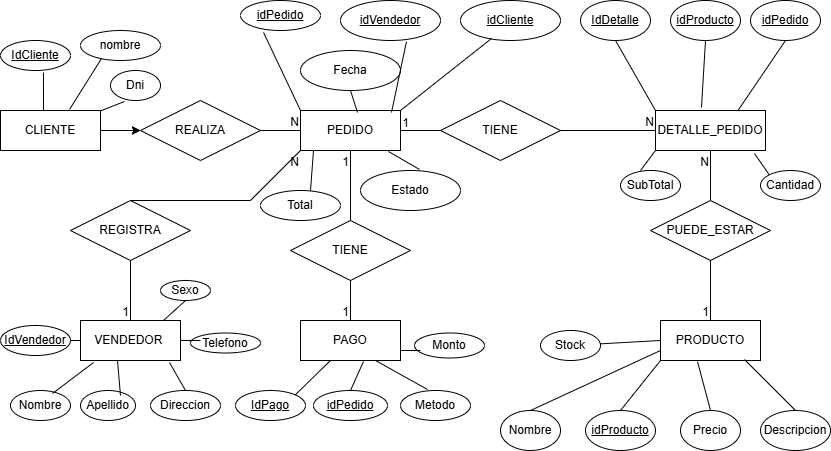

# sistemas-ventas-comida
-----------------

## Descripcion 
El sistema de ventas de comida es una aplicación diseñada para gestionar de manera eficiente el proceso de venta de alimentos en un negocio y permite administrar la información de clientes, productos, pedidos, pagos y vendedores este  sistema nos facilita el registro de pedidos, el control de productos disponibles, el cálculo automático de totales y el seguimiento de cada venta realizada.esta orientado a mejorar la organización del negocio, reducir errores en el registro manual y optimizar el tiempo de atención al cliente.

-----

## componentes del sistema

### gestion de productos 
- registrar productos
- Actualizar los precios.
- controlar el stock.
### Gestion del pedido 
- crear producto
- agregar productos 
- calcular el total 
- cambiar de estado
### Gestion del los clientes
- registrar al cliente 
- consultar su informacion

### Gestion de pagos 
- registrar pagos 
- metodo de pago

----
## Regla del negocio 
- un pedido debe contener al menos un producto
- Nose puede vender sin no hay stock
- el total va ser la suma de todos los productos
- cada pedido tiene que tener fecha y hora 
- un pedido debe estar asociado a un cliente 
- el precio debe ser mayor a 0

------

## Entidades 

### Cliente
- id_cliente
- nombre
- apellido
- Dni

### Producto
- id_producto
- nombre
- descripcion
- precio
- stock

### Pedido
- Id_pedido
- id_vendedor
- id_cliente
-fecha 
- estado
- total

### Detalle_pedido
- id_detalle
- id_pedido
- id_producto
- cantidad 
- subtotal

### Pago
- id_pago
- id_pedido
- metodo
- monto
-----------

### relaciones
- cliente---realiza----pedido (1:N)
- vendedor-----registra----pedido (1:N)
- pedido-----tiene----detalle_pedido (1:N)
- producto---puede_estar---detalle_pedido (1:N)
- pedido---tiene---pago (1:1)
------------
#### Avance
-Dia 1

## Modelo entidad-relacion

----------

## Enunciado Del Sistema
El sistema de ventas de comida permite gestionar la información de clientes, productos, pedidos, pagos y vendedores.Un cliente puede realizar varios pedidos, y cada pedido es registrado por un vendedor. Cada pedido contiene uno o varios productos, los cuales se gestionan mediante la entidad DetallePedido, permitiendo especificar la cantidad y el subtotal de cada producto.Los productos pueden formar parte de múltiples pedidos, por lo que existe una relación muchos a muchos entre pedido y producto, resuelta mediante la entidad DetallePedido.Cada pedido genera un pago asociado, el cual incluye el método de pago y el monto correspondiente.El sistema permite controlar el stock de productos, calcular el total de cada pedido y mantener un registro de las transacciones realizadas.

-------------

## Avance
- dia2
